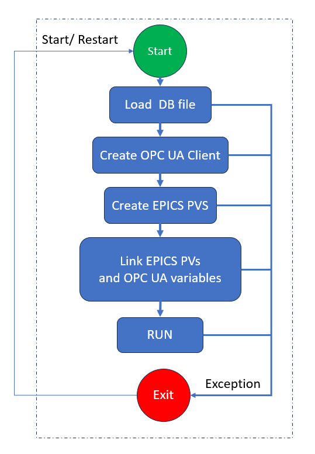

# Introduction 

OPC UA is a service-orientated communication architecture  that supports platform-independent, data exchange between
embedded microcontrollers, PLCs or PCs and cloudbased infrastructure. This makes OPC UA ideal for developing
manufacturer independent communication to vendor specific PLCs, for example. With this in mind, we present
an OPC UA to EPICS bridge that has been containerized with Docker to provide a microservice for communicating
between EPICS and OPC UA variables.


Figure 1 shows how the system may be deployed with multiple EPICS clients communicating to two PLCs though two OPC UA EPICS bridges.


# SYSTEM OVERVIEW
A high-level state machine diagram of implementation of the OPC UA EPICS bridge microservice is shown in Figure 1. The microservice is written in Python and 
containerized with Docker. 



In particular, we make of the dbtoolspy project, Python SoftIOC project and OPCUA-asyncio modules to implement the system. Descriptions
of the states of the service are given below:
## Start
When the service is started, environment variables are passed to the service. These environment variables determine
the uniform resource locator (URL) of the OPC UA server, the subscription rate, the EPICS record file to use,
and whether to connect securly to the server.
## Load DB file 
Thereafter, we use dbtoolspy to load EPICS records that describe the relationship between the OPC UA and EPICS variables. The dbtoolspy module conveniently loads the record information and exposes this as a dictionary in Python.

## Create OPC UA Client
We make use of the Python Opcua-asyncio open source project to establish a client connection to a OPC UA server. We use the information loaded in the proceeding step to configure the subscriptions to each of the OPC UA
variables. The EPICS DTYP, INP and OUT field is used to make the correct subscription type to each of the variables. As mentioned previously, the URL of the server and the subscription rate are passed to the service as environment
variables.
## Create EPICS PVs 
We use the Python SoftIOC project to establish each of the EPICS process variables (PVs) for the EPICS input output controller (IOC). We use the information loaded in the Load DB file step to configure each of the EPICS PVs.

## Link EPICS PVs and OPC UA variables
Finally, we link between the OPC UA Client variables and the EPICS IOC PV’s data change callbacks based on the information loaded in the Load DB file step. The callbacks perform type checking, and type cast the new values between
the data types used internally in the OPC UA and EPICS.
## Run
If no exceptions occur during the loading of previous steps, then the bridge is kept alive indefinitely. If an exception occurs, for example, if the PLC is rebooted, a connectivity exception will be thrown and the bridge service will exit.
## Exit
When the microservice is stopped or an exception occurs, the system will exit. All the listening EPICS clients will therefore get a channel access (CA) exception notification. If the microservice is configured to restart, then connectivity will resume on the EPICS CA when the new instance
of the bridge establishes connection.

# CONFIGURATION AND DEPLOYMENT
The system is designed to be orchestrated with Docker Compose, although any other orchestration system such as Kubernetes can be used by porting the configuration file. Example YML configuration files are available in root folder.


Prerequisites: git, latest version of docker-ce and docker compose 

( At the time of writing the system used Docker V23.0.3 and docker compose V2.17.2 )

To install docker-ce  and docker compose on Unbuntu follow:

https://docs.docker.com/engine/install/ubuntu/

It is advised to the follow the Post Installation steps for Linux:

https://docs.docker.com/engine/install/linux-postinstall/


1st clone this repo, with the --recurse-submodules option :

SSH:
```bash
git clone --recurse-submodules git@github.com:React-Automation-Studio/OPCUA-EPICS-BRIDGE.git

```
or

HTTPS: 
```bash
git clone --recurse-submodules https://github.com/React-Automation-Studio/OPCUA-EPICS-BRIDGE.git

```


# 2 Launching the Docker compose files
The systems uses Docker to create isolated production and development environments. There are several docker-compose configuration files.

## Python Unsecure Server 
Firstly bring up the Python demo unsecure OPCUA server in a terminal. I tbundle a Python OPC UA  server and the bridge together.

In the root folder run:
```bash
docker compose  -f example-unsecure-localserver.yml  up --build
```


This will load an opcua  server test variables and the Epics bridge with variables declare in the db/test.tb

The Epics process variables can then be access via any Epics client such as caput, caget and cainfo for example or through a the GUI available at:

https://github.com/wduckitt/React-Automation-Studio-Example-OPCUA.git


You can also use UAexpert to verify if the server is running on:
 opc.tcp://localhost:4840/freeopcua/server/


# 38 Contact

Contact us at Github Discussions: https://github.com/React-Automation-Studio/React-Automation-Studio/discussions
