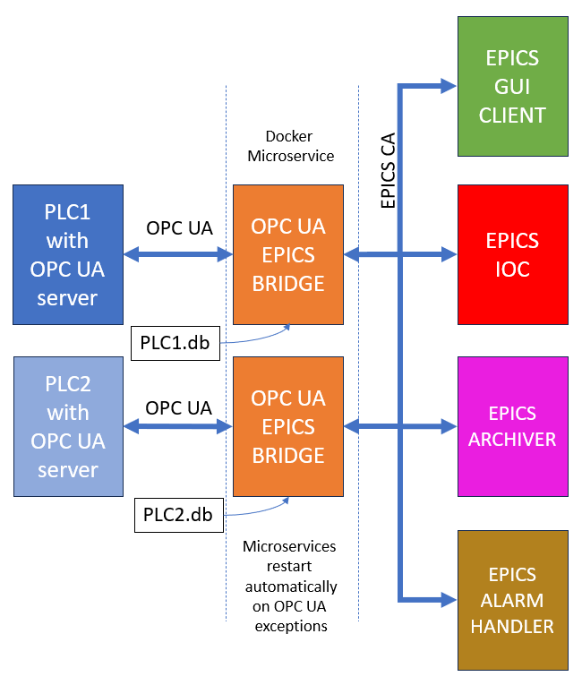
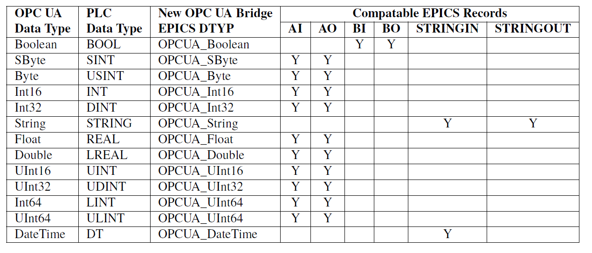
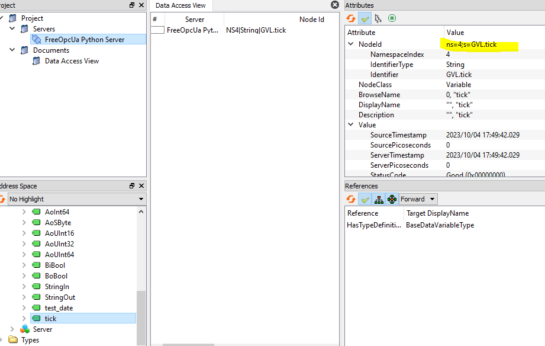

Current release: V1.0.0
# Introduction 

OPC UA is a service-orientated communication architecture  that supports platform-independent, data exchange between
embedded microcontrollers, PLCs or PCs and cloudbased infrastructure. This makes OPC UA ideal for developing
manufacturer independent communication to vendor specific PLCs, for example. With this in mind, we present
an OPC UA to EPICS bridge that has been containerized with Docker to provide a microservice for communicating
between EPICS and OPC UA variables.




Figure 1 shows how the system may be deployed with multiple EPICS clients communicating to two PLCs though two OPC UA EPICS bridges.


# System Overview
The OPCUA EPICS Bridge is written in Python and 
containerized with Docker. We make of the dbtoolspy project, Python SoftIOC project and OPCUA-asyncio modules to implement the system. 
The Docker environment variables determine the uniform resource locator (URL) of the OPC UA server, the subscription rate, the EPICS record file to use,
and whether to connect securly to the server.

The microservice loads EPICS records that describe the relationship between the OPC UA and EPICS variables. The system establishes connection to the OPC UA server and creates an EPIC IOC for the variables. It links between the OPC UA Client variables and the EPICS IOC PV’s data change callbacks based on the information loaded db fle. The callbacks perform type checking, and type cast the new values between the data types used internally in the OPC UA and EPICS.

If no exceptions occur, then the bridge is kept alive indefinitely. If an exception occurs, for example, if the PLC is rebooted, a connectivity exception will be thrown and the bridge service will exit.

When the microservice is stopped or an exception occurs, the system will exit. All the listening EPICS clients will therefore get a channel access (CA) exception notification. If the microservice is configured to restart, then connectivity will resume on the EPICS CA when the new instance of the bridge establishes connection.

# Configuration and deployment
The system is designed to be orchestrated with Docker Compose, although any other orchestration system such as Kubernetes can be used by porting the configuration file. Example YML configuration files are available in root folder.


Prerequisites: git, latest version of docker-ce and docker compose 


To install docker-ce  and docker compose on Unbuntu follow:

https://docs.docker.com/engine/install/ubuntu/

It is advised to the follow the Post Installation steps for Linux:

https://docs.docker.com/engine/install/linux-postinstall/


1st clone this repo, with the --recurse-submodules option :

SSH:
```bash
git clone --recurse-submodules git@github.com:React-Automation-Studio/OPCUA-EPICS-BRIDGE.git

```
or

HTTPS: 
```bash
git clone --recurse-submodules https://github.com/React-Automation-Studio/OPCUA-EPICS-BRIDGE.git

```


# 2 Launching the Docker compose files
There are several docker-compose configuration files.

## Python Unsecure Test OPC UA Server 
Firstly bring up the Python demo unsecure OPCUA server in a terminal. It bundles a testing Python OPC UA  server and the bridge together.

In the root folder run:
```bash
docker compose  -f example-unsecure-localserver.yml  up --build
```


This will load an opcua  server test variables and the Epics bridge with variables declare in the db/test.tb

The Epics process variables can then be access via any Epics client such as caput, caget and cainfo for example or through a the GUI available at:

https://github.com/wduckitt/React-Automation-Studio-Example-OPCUA.git


You can also use UAexpert to verify if the server is running on:
 opc.tcp://localhost:4840/freeopcua/server/

UAExpert is available at https://www.unified-automation.com/products/development-tools/uaexpert.html


## Python Secure Test OPC UA Server 

It can be tricky to create the secure server and generate the certificates. Therefore, for testing purposes, we provide two scripts in the certificates folder to generate the server and the client certificates.

In the certificates folder run:
```bash
./generate_example_server_certificate.sh
```
This will create the certificates/server.der certificates/server_private_key.pem files.

The Python OPCUA test server needs them to start the server in a secure mode.

Next, in the certificates folder run:
```bash
./generate_example_client_certificate.sh
```
This will create the certificates/client.der certificates/client_private_key.pem files.

The Pyhton OPC UA test server the requires the client certificate to grant access and is loaded at run time.

Once you have created the example certificates you can launch the secure server.


In the root folder run:
```bash
docker compose  -f example-secure-localserver.yml  up --build
```


This will load OPC UA  server test variables and the Epics bridge with variables declare in the db/test.tb

The Epics process variables can then be accessed via any Epics client such as caput, caget and cainfo for example or through a the GUI available at:

https://github.com/wduckitt/React-Automation-Studio-Example-OPCUA.git


Like with the unsecure mode, you can use UAexpert to verify if the server is running on:
 opc.tcp://localhost:4840/freeopcua/server/

Note the UA expert will require you to trust the server's certificate.

Also you must copy client.der and client_private_key.pem to your local folder and make sure the UAExpert authentication settings are set to use the certificate and private key.


## Twincat Test Server

### Unsecure mode
We provide the source code for a test PLC for Twincat at https://github.com/React-Automation-Studio/OPCUA-TwinCAT-Example-Project

It requires extensive knowledge of the TwinCAT environment.

You will need to port to your version of PLC, but effectively the PLC project creates PLC variables that when served over OPC UA present themselves as variables equivalent to the Python Test serve above.

Once the PLC is up and running and serving the variables over OPC UA, we recommend first using UAExpert to independently connect to the PLC. 

If UAExpert can connect, then in the root folder modify the URL parameter example-unsecure-beckhoff-server.yml to match the URL of the OPC UA server. Note: you may need to setup the PLC OPC UA server to accept anonymous connections.
 
Then launch:

```bash
docker compose  -f example-unsecure-beckhoff-server.yml  up --build
```

This will connect to the OPC UA server anonymously, if the PLC allows anonymous connections. 

The Epics process variables can then be accessed via any Epics client such as caput, caget and cainfo for example or through a the GUI available at:

https://github.com/wduckitt/React-Automation-Studio-Example-OPCUA.git


### Secure mode

If a secure connection is required you will need to copy, modify the example-unsecure-beckhoff-server.yml and generate your own client certificates.

In this modified yml file change the - secure=False parameter to True and modify the URL parameter to match the URL of the OPC UA server.


You must generate your own client certificates for authentication. For testing purposes, you can use the script in certificates folder to generate the client certificate.


In the certificates folder run:
```bash
./generate_example_client_certificate.sh
```
This will create the certificates/client.der certificates/client_private_key.pem files.

If you use another method to generate your client certificates you must either copy them into the certificates folder and call them client.der and client_private_key.pem or mount them in the certificates folder with the names client.der and client_private_key.pem.

Once you have created the certificates you can launch the bridge.


In the root folder run:
```bash
docker compose  -f example-secure-localserver.yml  up --build
```
Where example-secure-localserver corresponds to the name of the yml file you created. 


This will load the OPC UA Epics bridge with variables declared in the db/testBeckhoff.tb


Like with the other methods the Epics process variables can then be accessed via any Epics client such as caput, caget and cainfo for example or through a the GUI available at:

https://github.com/wduckitt/React-Automation-Studio-Example-OPCUA.git
 
# Recipe for Connecting to another OPC UA Server on a new PLC
1. Install the manufacturers OPC UA server on the PLC.
2. Expose the necessary variables over OPC UA.
3. Configure the OPC UA Server in anonymous i.e. unsecure mode or secure mode. If secure mode is used, then generate the client certificates.
4. Next, independently verify connection to the OPC UA server using  UAExpert.
5. Take note of the namespace index and string connection of the variables from available on the attributes tab of the variable in UAExpert. (See the notes below)
5. Copy the db/testBeckhoff.db and give it a name of your choice. Modify the variables to match your OPC UA variables.
6. Copy and modify the example-unsecure-beckhoff-server.yml and modify it similarly to the steps in the previous section. Take note you might want to  alter the name, URL and subscriptionRate parameter too.
7. Then launch this new yml file.

# Notes:
## Compatibility
Table 1: Compatibility between OPC UA data types, PLC data types and EPICS records and the OPC UA EPICS bridge
DTYP



## EPICS records and OPC UA connection string

```bash
record(ai, "Beckhoff:tick")
{       
        field(DTYP,"OPCUA_Int64")
        field(INP, "ns=4;s=GVL.tick")
        field(DESC, "tick")
}

record(ao, "Beckhoff:AoInt32")
{       
        field(DTYP,"OPCUA_Int32")
        field(OUT, "ns=4;s=GVL.AoInt32")
        field(DESC, "Ao int32 ")
        field(HOPR, "2147483647")
        field(LOPR, "-2147483648")
        field(PREC, "0")
}

```
As the example record snippets above, the INP field contains a string to connect to the OPC UA variable. You can easily extract the namespace and connection string from UAExpert, like in the image below:



For EPICS AO records you must set the HOPR  and LOPR to the min and max values aloud for the PLC variable type or to the upper and lower bound of PLC variables setpoints. See all the examples in the test.db files for the absolute max and min HOPR and LOPR fields for the corresponding OPC UA data type.


## Deafult compose environment variables:
```bash

environment:
      - name=OpcuaTest1  ### name of the OPC UA server
      - url=opc.tcp://0.0.0.0:4840  ### URL of the OPC UA server
      - subscriptionRate=100  ### subscription rate in milliseconds
      # - debug=True  ### will print debug message in development mode
      - secure=True   ### start the OPC UA connection in secure / unsercure mode
```

## Limitations
 The EPICS records don't currently support forward linking, or macro substitutions.
 If we have missed loading a field for one of the EPICS record types, lets us know.


# Contact

Contact us at Github Discussions: https://github.com/React-Automation-Studio/React-Automation-Studio/discussions
